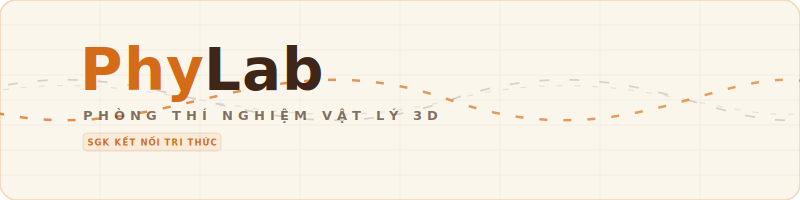

<p align="center">
  
</p>

<p align="center">
  
  
  
  
  
</p>

---

## Giới thiệu dự án

PhyLab là ứng dụng hỗ trợ học sinh thực hành các bài thí nghiệm Vật lý lớp 10 theo chương trình học (sách Kết nối tri thức với cuộc sống). Dự án giúp số hóa các thao tác thực hành thành mô phỏng tương tác, đi kèm trợ lý học tập hỗ trợ giải đáp lý thuyết và thuật toán tự động chấm điểm thực hành.

Dự án hỗ trợ hai bài thực hành chính:
- Bài 6: Đo tốc độ tức thời và tốc độ trung bình trên máng nghiêng.
- Bài 11: Đo gia tốc rơi tự do.

---

## Hướng dẫn cài đặt và chạy thử

Để cài đặt các thư viện phụ thuộc và chạy ứng dụng ở máy local, bạn mở terminal tại thư mục dự án và chạy lệnh:

```bash
npm install && npm run dev
```

*Ứng dụng sẽ được chạy tại cổng mặc định `3000`. Địa chỉ truy cập: http://localhost:3000*

### Chia sẻ đường dẫn truy cập từ xa (Tunnel)
Trong trường hợp cần chạy ứng dụng tại máy cá nhân nhưng muốn chia sẻ đường dẫn HTTPS công khai để người khác truy cập (ví dụ khi chạy thử nghiệm hoặc demo cho ban giám khảo), bạn có thể sử dụng câu lệnh tích hợp sẵn:

```bash
npm run demo
```

Lệnh này sẽ khởi động máy chủ Next.js đồng thời kích hoạt một đường hầm bảo mật thông qua Localtunnel. Đường dẫn truy cập công khai sẽ được in trực tiếp lên màn hình console.

---

## Hệ thống kiểm thử tự động

Dự án tích hợp bộ kiểm thử tự động gồm 16 kịch bản chạy offline (không cần kết nối internet hay gọi API thật bên ngoài). 

Để khởi chạy toàn bộ các bài kiểm thử:
```bash
npm run test:all -- --no-api
```

### Chi tiết các kịch bản kiểm thử:

#### 1. Kiểm thử thuật toán chấm điểm thực hành (11 kịch bản trong `src/lib/grading.ts`)
Phần này kiểm tra độ chính xác của logic chấm điểm và các hình phạt trừ điểm tương ứng với sai sót của học sinh:
- **Cấu hình giới hạn:** Kiểm tra dung sai cho phép (1%) và yêu cầu số lần đo tối thiểu (3 lần) có được áp dụng đúng.
- **Phân bậc điểm số (bandScore):** Kiểm tra tính đúng đắn khi quy đổi từ phần trăm độ sát số liệu sang thang điểm 10 (ví dụ: khớp >= 98% được 10 điểm, 80-89.9% được 6.5 điểm).
- **Tính toán công thức:** Kiểm tra công thức tính gia tốc rơi tự do $g = 2s/t^2$ từ quãng đường $s$ và thời gian $t$.
- **Trường hợp tối đa:** Kiểm tra kết quả chấm điểm khi học sinh thực hiện hoàn hảo các lần đo (đạt 10/10).
- **Kiểm tra dung sai tính toán:** Thử nghiệm trường hợp học sinh tính toán sai lệch kết quả vượt quá 1.5% xem hệ thống có nhận diện và đánh dấu sai sót hay không.
- **Hình phạt lỗi trình tự:** Kiểm tra việc trừ điểm khi học sinh đo nhưng quên chưa căn chỉnh máng nghiêng cân bằng (phạt 2.5 điểm cho mỗi lần lỗi).
- **Hình phạt thiếu số lần đo:** Kiểm tra việc trừ 2 điểm khi số lần đo thực tế dưới mức tối thiểu là 3 lần.
- **Xử lý dữ liệu trống:** Kiểm tra cách hệ thống tính điểm khi học sinh bỏ trống một vài ô kết quả.
- **Tính điểm tổng hợp:** Kiểm tra công thức tính điểm tổng hợp của bài thực hành theo tỷ lệ: 70% điểm đo đạc thực tế và 30% điểm vẽ đồ thị.

#### 2. Kiểm thử mô phỏng vật lý và truy vấn tri thức (5 kịch bản trong `scripts/test.mjs`)
Kiểm tra các thuật toán chuyển động của mô phỏng và công cụ tìm kiếm tài liệu hỗ trợ:
- **Gia tốc máng nghiêng:** Kiểm tra gia tốc trượt của vật ở góc nghiêng 30 độ (kết quả phải xấp xỉ 3.5 m/s²).
- **Vận tốc tức thời:** Kiểm tra tính vận tốc tức thời tại các vị trí khác nhau trên máng trượt.
- **Cổng quang điện:** Kiểm tra thời gian chắn sáng của viên bi đi qua cổng quang điện (mode A) và khoảng thời gian di chuyển giữa hai cổng (mode A<->B).
- **Thời gian rơi tự do:** Kiểm tra thời gian rơi tự do từ độ cao 0.4m dựa trên gia tốc trọng trường $g = 9.8$ m/s².
- **Tìm kiếm dữ liệu lý thuyết (RAG):** Kiểm tra tính đúng đắn của công cụ truy vấn tài liệu hỗ trợ lý thuyết và chuẩn hóa tiếng Việt không dấu (`normalizeVi`) khi học sinh đặt câu hỏi hỗ trợ.

---

## Thiết lập an toàn thông tin và bảo mật dữ liệu

Dự án áp dụng các cơ chế bảo vệ mã nguồn và thông tin chạy thử:
- **Xác thực Server-side:** Việc kiểm tra mật khẩu tài khoản được xử lý ở phía server thông qua endpoint `/api/auth/login`. Mật khẩu được ẩn và không bao giờ xuất hiện ở mã nguồn phía client.
- **Bảo mật biến môi trường:** Các thông tin nhạy cảm (API Keys của VNPT AI, thông tin tài khoản quản trị) được đưa vào tệp `.env.local` và được Git bỏ qua thông qua cấu hình `.gitignore`. Danh sách các biến mẫu được cung cấp trong tệp `.env.example`.

---

<p align="center">
  
</p>
