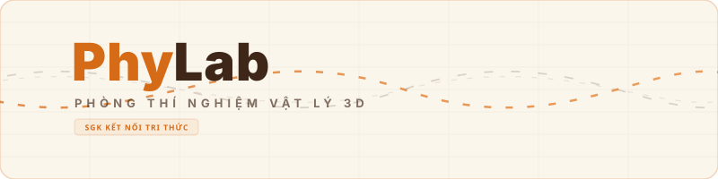

<p align="center">
  
</p>

<p align="center">
  
  
  
  
  
  
</p>

---

## Giới thiệu

PhyLab là phòng thí nghiệm Vật lí ảo cho học sinh THPT, bám theo các bài thực hành trong SGK Vật lí
bộ *Kết nối tri thức với cuộc sống*. Học sinh đi trọn một buổi thực hành trên máy: làm quen dụng cụ,
tự lắp ráp và đo trên bàn thí nghiệm mô phỏng, rồi xử lý số liệu, vẽ đồ thị và in báo cáo.

Số đo không bịa: thời gian, dòng điện, hiệu điện thế… đều sinh ra từ mô hình vật lý, cộng nhiễu
giống dụng cụ thật. Đo lại nhiều lần thì kết quả ổn định nhưng không lần nào giống hệt lần nào.

### Các bài đang mở

| Lớp | Bài | Nội dung | Dụng cụ chính | Đại lượng cần tìm |
|---|---|---|---|---|
| 10 | Bài 6 | Tốc độ tức thời và tốc độ trung bình | Máng nghiêng, 2 cổng quang, đồng hồ MC964, thước kẹp | v = d/t, v̄ = s/t |
| 10 | Bài 11 | Gia tốc rơi tự do | Giá đỡ có dây dọi, nam châm điện, trụ thép, cổng quang, MC964 | g = 2s/t² |
| 10 | Bài 15 | Định luật 2 Newton (thí nghiệm minh hoạ) | Máng đệm khí + bơm khí, xe trượt 200 g, 10 quả nặng 50 g, ròng rọc, 2 cổng quang cách 0,5 m, tấm chắn 10 cm, đồng hồ hiện số, cân điện tử | a = 2s/t², a = F/(M + m) |
| 11 | Bài 23 | Điện trở — Định luật Ohm | Nguồn DC, 2 đồng hồ đa năng, vật dẫn X và Y | R = U/I |
| 11 | Bài 26 | Suất điện động của pin điện hoá | Bảng mạch 216 nút, biến trở, R₀, khoá K, 2 đồng hồ đa năng | U = E − I·r |

Đã có trong danh mục, đang làm bàn thí nghiệm: Bài 19 *Bảo toàn động lượng* (lớp 10), Bài 22 *Tiêu cự
thấu kính hội tụ* (lớp 11), Bài 15 *Giao thoa ánh sáng* (lớp 12).

**Bài 15 bám sát SGK:** đủ 9 dụng cụ đánh số như Hình 15.2 (cộng xe trượt), đo đúng 5 cột Bảng 15.1
(F = 1, 1, 1, 2, 3 N; M + m = 0,3; 0,4; 0,5; 0,5; 0,5 kg), hai đồ thị trực tiếp như Hình 15.3a/b.
"Vật" là hệ xe + quả nặng; lực kéo là trọng lượng quả treo (SGK lấy g ≈ 10 m/s²). Làm ẩu thì số liệu lệch
và bench nói vì sao: quên bật máy nén khí hay để lưu lượng yếu (ma sát giữ xe lại), máng chưa ngang, tấm chắn
không sát cổng 1 (v₀ ≠ 0 nên a = 2s/t² bị lớn), quên Reset, sai MODE, lấy thêm quả từ hộp thay vì chuyển quả từ
xe sang móc. **Nghịch như đồ thật:** bấm vào xe là tay giữ, chạm lần nữa là buông (xe chạy theo lực thật, chụp
lại được khi đang chạy); tự kéo từng quả nặng lên móc treo / lên xe; đồng hồ chạy theo tín hiệu cổng quang nên
kéo xe bằng tay qua cổng cũng làm đồng hồ chạy — đặt xe xong mới Reset.

### Một buổi thực hành trên PhyLab

1. **Tìm bài.** Chọn ở Trang chủ hoặc Phòng Lab, hoặc chụp một trang SGK ở màn *Quét tài liệu* để app
   tự nhận ra bài (VNPT SmartReader OCR + đối chiếu từ khoá).
2. **Prelab.** Lần đầu vào một bài, Prelab luôn mở trước. Làm quen dụng cụ: cổng quang, đồng hồ MC964
   (vặn núm MODE, đổi thang, Reset), thước kẹp đo đường kính bi, cân bằng giá đỡ bằng dây dọi; lớp 11
   là đồng hồ đa năng (núm xoay, cổng cắm que đo), nguồn DC hoặc bảng mạch, **tự vẽ sơ đồ mạch** (nối dây
   giữa các kí hiệu, máy giải mạch thật để chỉ ra ampe kế mắc sai, đảo cực, K không nằm trên mạch
   chính…) và **ba bài tính gốc** (bắt đúng lỗi quen: quên đổi mA, đảo công thức). Làm đủ thao tác bắt
   buộc mới mở khoá Phòng Lab. Bài 15: Tổng quan, Hình 15.2 chạm-để-khám-phá, **máy nén khí** (bộ phận, núm
   lưu lượng, lát cắt đệm khí dưới xe), thử đẩy xe ở từng nấc (bắt buộc), đồng hồ A↔B và một trang giới thiệu
   công thức (không bắt tính).
3. **Phòng Lab.** Kéo dụng cụ lên bàn, nối dây, cân bằng, bật nguồn, chọn thang đo rồi đo. Sai
   thao tác thì số đo sai theo đúng vật lý: máng chưa cân bằng làm bi chậm hơn, để khoá K đóng lâu làm
   vật dẫn nóng lên và điện trở tăng, mắc ampe kế song song với pin thì không đóng được K vì dòng quá
   lớn sẽ cháy cầu chì. Đồng hồ đa năng đo được cả V, mA, µA và Ω. Trên **điện thoại**, bấm vào Lab là tự
   chuyển toàn màn hình và **khoá ngang** (Android); iPhone không cho khoá hướng nên hiện màn nhắc xoay ngang.
   Khi xoay ngang, hướng dẫn nằm ở **cột bên phải** (thu gọn được) thay vì thanh kéo đè lên bàn, và khung
   hình bàn thí nghiệm tự nới theo tỉ lệ màn nên không còn dải trống hai bên.
4. **Sổ Báo Cáo.** Bảng số liệu gọn theo từng bài, học sinh tự điền kết quả tính. Đồ thị có hai chế
   độ: *Máy vẽ* (bình phương tối thiểu, R², phương trình đường thẳng) và *Em tự vẽ* (chấm điểm lên
   giấy kẻ ô, kéo đường thẳng rồi so với máy). Báo cáo in thẳng ra khổ A4.
5. **Ôn tập.** Flashcard và câu hỏi trắc nghiệm theo từng bài.

### Hướng dẫn cho người mới (guided tour)

- **Tham quan lần đầu vào app**, có linh vật **Photon** dẫn đường. Gồm ba chương: *Làm quen* (điều
  hướng, quét SGK, bài nên làm tiếp, danh sách Lab), *Phòng Lab* (sơ đồ 4 khu của bàn thí nghiệm, chạm
  từng khu để xem) và *An toàn* theo SGK Vật lí 10 — Bài 2. Phần An toàn gồm: mini-game **săn 4 chỗ nguy
  hiểm** trong phòng thí nghiệm, thẻ lật kí hiệu trên thiết bị, biển báo, 9 quy tắc, xử lí sự cố và câu
  hỏi chốt. Đi hết thì nhận *Phiếu vào Phòng Lab* và **huy hiệu An toàn PTN** hiện ở Trang chủ.
- **Tour Phòng Lab** tự mở đúng một lần, lần đầu vào bàn thí nghiệm bất kì (bàn nào cũng chung bố cục).
- **Tour Sổ Báo Cáo** tự mở lần đầu vào Sổ, có thử thách tự vẽ đồ thị so với máy.
- Nút dấu hỏi (header và thanh công cụ Lab) mở lại được mọi tour. Mỗi lúc chỉ một tour hiện.

### Dành cho giáo viên (đang tạm khoá)

> Chức năng Lớp học đang **tạm khoá** bằng cờ `FEATURES.classroom` trong `src/lib/features.ts`: mục
> *Lớp của tôi* hiện ổ khoá, app không gọi API lớp học, tài khoản giáo viên thấy thông báo tạm khoá. Mở
> lại chỉ cần đổi cờ thành `true` — code bên dưới vẫn giữ nguyên.

Đăng nhập bằng tài khoản giáo viên (cấu hình qua `TEACHER_EMAIL` / `TEACHER_PASSWORD`):

- **Tạo lớp bằng mã 5 ký tự.** Học sinh nhập mã ở tab *Lớp của tôi* để vào lớp.
- **Giao bài Lab với đề tự đặt** cho các bài 6, 11, 23, 26: góc θ và quãng EF (Bài 6), quãng rơi s (Bài 11), 5 mức
  điện áp cho vật dẫn X, Y (Bài 23), 5 mức biến trở (Bài 26). Giáo viên thấy đáp án mong đợi tính từ
  engine vật lý. Học sinh bấm *Lưu & nộp* trong Sổ Báo Cáo là bài được gửi lên lớp; server tự chấm lại
  bằng `gradeLesson`, không tin điểm do trình duyệt gửi lên.
- **Quiz theo form đề Bộ GD&ĐT 2025**: trắc nghiệm, Đúng/Sai 4 ý (0,1 → 1 điểm), trả lời ngắn. Đáp án
  không bao giờ rời server.
- **Quiz chống gian lận**: đề sinh riêng từ chính số liệu Lab của từng em, chép bài bạn là vô nghĩa.
- **Theo dõi lớp**: mức hoạt động 7 ngày, chi tiết bài nộp từng em, bản đồ lỗi sai của cả lớp, xuất
  bảng điểm CSV mở thẳng bằng Excel.

Dữ liệu lớp học lưu qua 3 tầng tự chọn theo môi trường: Cloudflare D1 (production) → file JSON
`.data/` (chạy local hoặc demo qua tunnel, giữ được qua restart) → bộ nhớ tạm. Chi tiết ở
[`docs/PHYLAB_FEATURES.md`](docs/PHYLAB_FEATURES.md) mục 20.

---

## Cài đặt và chạy

Cần Node.js 20 trở lên.

```bash
git clone https://github.com/khanhhocly123-cell/phylab.git && cd phylab && npm install
```

Tạo `.env.local` từ `.env.example`. Thiếu biến nào thì tính năng đó tự chuyển sang chế độ dự phòng
(OCR báo lỗi rõ ràng, TTS dùng giọng đọc của trình duyệt, trợ lý dùng tri thức nội bộ), phần mô phỏng
vẫn chạy đủ.

```bash
npm run dev
```

App chạy ở http://localhost:3000.

| Lệnh | Việc làm |
|---|---|
| `npm run dev` | Dev server (Turbopack) |
| `npm run build` / `npm start` | Build production (webpack) và chạy bản build |
| `npm run demo` | Dev server + Localtunnel, in ra đường dẫn HTTPS công khai để demo từ máy khác |
| `npm run lint` | ESLint (có luật React Compiler) |
| `npm run test:all -- --no-api` | Toàn bộ kiểm thử offline |
| `npm run clean` | Xoá thư mục `.next` khi cache hỏng |
| `npm run preview` / `npm run deploy` | Build OpenNext rồi chạy thử / đẩy lên Cloudflare |
| `npm run db:migrate` / `db:migrate:remote` | Áp migration D1 (local / remote) |

---

## Kiểm thử

```bash
npm run test:all -- --no-api
```

Chạy hoàn toàn offline, không gọi API ngoài. Cờ `--no-api` bỏ qua phần gọi dev server và VNPT (hiện
thành 3 cảnh báo "bỏ qua", không phải lỗi). Các nhóm kiểm thử:

1. **Bộ chấm điểm** (`src/lib/grading.ts`) — băng điểm theo độ sát, dung sai 1%, tối thiểu 3 lần đo,
   phạt đo khi chưa cân bằng, đo sai cấu hình giáo viên giao, tỉ lệ 70/30 giữa thí nghiệm và đồ thị.
2. **Vật lý và tri thức** (`scripts/test.mjs`, chạy riêng bằng `npm test -- --no-api`):
   - Cơ học: gia tốc bi lăn trên máng, cổng quang ở các MODE của MC964, rơi tự do, nhiễu đo (không
     trùng nhau nhưng σ ≤ 3 ms), trụ còn đung đưa, máng chưa cân bằng, đường kính bi theo tên học sinh.
   - Điện: sụt áp trên ampe kế, vật dẫn nóng làm R tăng, bộ giải mạch `solveDC`, bảng mạch Bài 26,
     đồng hồ đo Ω (đo qua pin báo sai, R₀ khi khoá K mở ≈ 10 Ω, K đóng thì báo có điện, chưa nối
     dây thì OL).
   - Prelab điện: chấm sơ đồ mạch mẫu của Bài 23/26 (40 mA · 6 V và U = E − I·r), phát hiện đổi chỗ
     ampe kế ↔ vôn kế, ampe kế đảo cực, K mắc song song; bài tính nhận dấu phẩy và nhắc đúng lỗi.
   - Tra cứu tri thức (RAG) và chuẩn hoá tiếng Việt không dấu.
3. **Lớp học** (`scripts/test-class.mjs`) — thang Đúng/Sai của Bộ GD, dung sai trả lời ngắn (nhận cả
   "9,8"), lược đáp án trước khi gửi xuống client, quiz chống gian lận sinh đề tất định, đề giáo viên
   tự đặt.

`npm run test:all` (không có cờ) chạy thêm kiểm tra đường dự phòng `/api/vnpt/chat` và chẩn đoán
SmartBot trực tiếp, cần dev server đang chạy và `.env.local`.

---

## Cấu trúc mã nguồn

```
src/
├─ app/                       Shell (page.tsx), trang giới thiệu, globals.css, API routes
│  └─ api/                    vnpt/{chat,ocr,ekyc,tts,status} · class/[action] · auth/login
├─ data/
│  ├─ labCatalog.ts           Danh mục bài thí nghiệm — nguồn dữ liệu duy nhất cho mọi màn
│  └─ quizBank.ts             Flashcard + trắc nghiệm ôn tập theo bài
├─ experiments/specs.ts       Lý thuyết, dụng cụ, các bước, homework của từng bài
├─ engine/                    Vật lý thuần JS/TS, không phụ thuộc UI
│  ├─ physics.js · physicsFreeFall.js · physicsElectric.ts
│  ├─ circuit.js              Bộ giải mạch DC (phương pháp nút, MNA)
│  └─ noise.js                Nhiễu đo dùng chung: gauss, jitter, quantize
├─ components/
│  ├─ HomeScreen · ScanScreen · Prelab · NoteSection · LoginScreen
│  ├─ lab/                    LabHub, LabRoom (định tuyến bàn), LabChrome, animStore
│  │  ├─ LabBench.jsx · FreeFallBench.jsx · ElectricalBench.jsx · EmfBench.jsx
│  │  ├─ mech/MechParts.jsx   Dụng cụ cơ học SVG: máng, giá đỡ, cổng quang, MC964, nam châm…
│  │  └─ electric/            Đồng hồ đa năng, bảng mạch, emfBoard (lưới 216 nút), EmfGraph
│  ├─ prelab/                 PrelabShell + Photogate, MC964 (kèm thước kẹp), PlumbBase, Electrical,
│  │                          CircuitSketch (vẽ sơ đồ), CalcDrills + calcDrillData (bài tính gốc)
│  ├─ tour/                   GuidedTour (spotlight), tours (nội dung), SafetyDeck, HazardHunt,
│  │                          Mascot (Photon), HelpMenu
│  ├─ notes/                  notebookData.ts (hồi quy, dựng đồ thị), NotebookGraph.tsx
│  ├─ student/ · teacher/     Lớp học phía học sinh và giáo viên
│  └─ Latex.tsx               KaTeX + **đậm**, render an toàn XSS
└─ lib/                       grading, lessonMatch (nhận diện bài), labKnowledge (RAG),
                              problemGen, antiCheatQuiz, moeQuiz, db (D1 → file → bộ nhớ), security,
                              schematic (sơ đồ mạch + chấm), tourState (đã xem tour, huy hiệu),
                              features (cờ tính năng)
scripts/                      test.mjs, test-class.mjs, test-all.mjs, demo.js
docs/                         PHYLAB_FEATURES.md (tài liệu đầy đủ), rubric chấm, dữ liệu SmartBot, tích hợp VNPT
```

---

## Thêm bài thí nghiệm mới

Mỗi bài có một `id` dạng slug (ví dụ `do-tieu-cu`) dùng xuyên suốt mọi file bên dưới.

**Bắt buộc**

1. **Danh mục** — thêm một dòng vào `LAB_CATALOG` trong `src/data/labCatalog.ts` với `status: "soon"`.
   Trang chủ, Phòng Lab, màn Quét và Sổ Báo Cáo tự hiện bài, tự chia theo lớp và chủ đề; không cần sửa
   giao diện. Khi bàn thí nghiệm chạy được thì đổi sang `"open"`.
2. **Kiểu dữ liệu** — thêm `id` vào `LessonId` và loại số liệu mới vào `RichTrial["lab"]` trong
   `src/lib/types.ts`.
3. **Đặc tả bài** — `ExperimentSpec` trong `src/experiments/specs.ts`: lý thuyết, dụng cụ, các bước, bảng
   số liệu, homework.
4. **Vật lý** — một file trong `src/engine/`. Số liệu phải sinh từ mô hình đúng, nhiễu lấy từ
   `engine/noise.js` (ổn định nhưng không lặp lại). Mạch điện thì dùng `solveDC` trong
   `engine/circuit.js`.
5. **Bàn thí nghiệm** — `src/components/lab/<Tên>Bench.jsx` và định tuyến theo `spec.id` trong
   `LabRoom.tsx`. Dụng cụ mới vẽ thành component SVG trong `lab/mech/` hoặc `lab/electric/` (xem
   *Quy ước giao diện* bên dưới).
6. **Sổ Báo Cáo** — trong `src/components/notes/notebookData.ts`: cột bảng (`columnsFor`) và đồ thị
   (`buildChart`: trục, có qua gốc toạ độ không, ý nghĩa hệ số góc; bài cần nhiều đồ thị như Bài 15 thì
   trả nhiều `ChartSpec` có `key`/`title` từ `buildCharts` — Sổ tự hiện nút chọn và in đủ); trong
   `NoteSection.tsx`: công thức kết quả, thẻ kết quả, bộ số liệu mẫu. Thêm loại số liệu vào `LabKind`
   (`lib/grading.ts`) và hai bảng tên trong `lib/antiCheatQuiz.ts`.
7. **Kiểm thử** — thêm test vật lý cho bài vào `scripts/test.mjs`.

**Nên có**

- Prelab: `src/components/prelab/` và rẽ nhánh trong `src/components/Prelab.tsx` (mẫu gần nhất:
  `NewtonPrelab.tsx` cho Bài 15). Bài điện có thể thêm sơ đồ vào `SCHEMATICS` (`lib/schematic.ts`); bài
  tính của bài nào cũng thêm vào `CALC_DRILLS` (`calcDrillData.ts`) rồi dùng `CalcDrills`.
- Bàn mới nên dùng `stageFit.js` (`fitViewBox` + `useBoxSize` cho khung hình tự nới, `svgPoint` để đổi toạ
  độ kéo thả) và đặt `MobileLabSheet` làm ô lưới riêng với `mobileLabColumns` — xoay ngang là thành cột
  hướng dẫn, không đè lên bàn.
- Ảnh bìa thẻ bài: `public/images/` (ảnh Bài 15 dựng từ chính các linh kiện SVG, xuất WebP bằng sharp).
- An toàn: nhóm dụng cụ tự suy từ chủ đề trong danh mục (Cơ học, Điện, Quang học, Nhiệt học — đã có sẵn
  quy tắc cho cả bốn trong `tour/SafetyDeck.tsx`); chủ đề mới thì thêm vào `LAB_GEAR_SAFETY`.
- Quét SGK: tiêu đề và từ khoá trong `src/lib/lessonMatch.ts`.
- Ôn tập: bộ câu hỏi trong `src/data/quizBank.ts`; tri thức cho trợ lý trong `src/lib/labKnowledge.ts`.
- Giáo viên giao bài: `teacher/LabAssignmentComposer.tsx`, `buildAssignedSet` trong
  `lib/problemGen.ts`, chấm ở `lib/grading.ts` và đề cá nhân ở `lib/antiCheatQuiz.ts`.
- Trang giới thiệu `src/app/gioi-thieu/page.tsx` (danh sách bài ở đây vẫn viết tay).

---

## Quy ước giao diện

- **Không bắt cuộn.** Panel của Phòng Lab, Prelab và Sổ Báo Cáo phải vừa một màn hình laptop; danh sách
  dài dùng hàng cuộn ngang hoặc khung cuộn nội bộ có giới hạn chiều cao.
- **Điện thoại.** Kiểm tra ở 375×812 và 812×375: thẻ bài xếp ngang, nút không gãy chữ (rút gọn nhãn bằng
  `sm:hidden` / `hidden sm:inline`), vùng chạm đủ lớn cho ngón tay. Bàn thí nghiệm dùng bố cục ngang
  (`lib/orientation.ts` + `lab/RotatePrompt.tsx`).
- **Mọi màn đọc từ `labCatalog.ts`.** Không viết cứng danh sách bài trong component, để thêm 10 hay 20 bài
  giao diện vẫn không vỡ.
- **Dụng cụ là component SVG, không dùng `filter`.** `feDropShadow`/`blur` bị vẽ lại mỗi khung hình
  khi có animation và từng kéo Bài 26 xuống khoảng 20 FPS. Bóng đổ làm bằng hình lệch bán trong suốt.
  Gradient lấy id từ `useId()` để nhiều bản cùng trang không đè nhau.
- **Tách lớp và memo.** Phần tĩnh của bàn (nền, bảng mạch, dụng cụ) bọc `React.memo`; phần thay đổi
  liên tục (số trên đồng hồ, dây đang kéo) để thành lớp riêng. Handler truyền xuống giữ ổn định qua ref.
- **Không dùng emoji trang trí.** Dùng icon `lucide-react` hoặc chữ thường.
- **Chữ không đè nhau.** Kiểm tra nhãn trên dụng cụ ở cả desktop và mobile trước khi xong việc.
- **Tour chỉ vào `data-tour="…"`.** Thêm màn mới cần hướng dẫn thì gắn mốc `data-tour` và thêm bước
  trong `tour/tours.tsx`; không tìm thấy mốc (vd. trên điện thoại) thì bước tự thành thẻ giữa màn hình.

---

## Vấn đề đang biết

- Token VNPT SmartReader (OCR) hiện trả HTTP 401. Màn Quét báo lỗi rõ ràng và cho chọn bài thủ công;
  cần cấp lại token trong `.env.local`.
- Chức năng Lớp học đang tạm khoá (`FEATURES.classroom = false`).
- Phần chấm điểm và trợ lý chat đã ẩn khỏi giao diện học sinh để làm lại. Logic chấm (`lib/grading.ts`)
  và API `/api/vnpt/chat` vẫn giữ nguyên; server vẫn chấm bài nộp cho giáo viên.
- `src/app/page.tsx` còn vài lỗi lint cũ (`set-state-in-effect`, `any`, biến thừa).

---

## Bảo mật

- **Xác thực phía server.** Mật khẩu kiểm tra ở `/api/auth/login`; phiên giáo viên ký HMAC-SHA256 với
  `AUTH_SECRET`, không có mật khẩu nào trong mã phía client.
- **Token VNPT chỉ nằm ở server.** Mọi lời gọi VNPT đi qua API route; CSP đặt `connect-src 'self'`.
- **Kiểm tra đầu vào.** Văn bản gửi lên được làm sạch và giới hạn độ dài; ảnh upload chỉ nhận
  png/jpg/webp/heic và tối đa 8 MB.
- **Biến môi trường.** Khoá bí mật để trong `.env.local` (đã có trong `.gitignore`); mẫu ở `.env.example`.

---

<p align="center">
  
</p>
